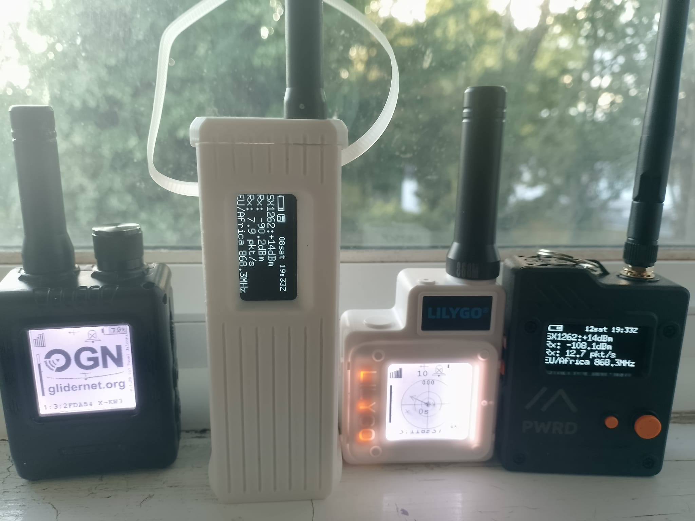
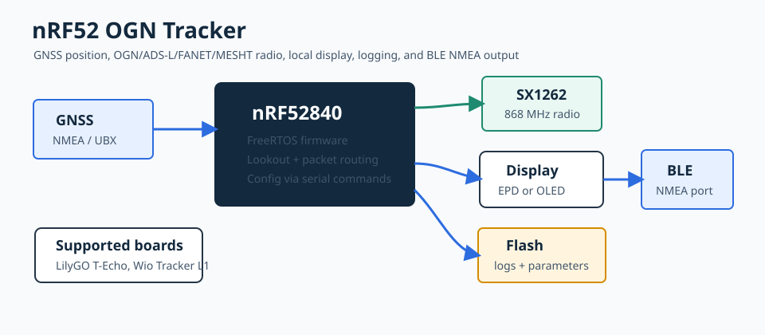

# nRF52 OGN Tracker

This is a port of my [OGN Tracker](https://github.com/pjalocha/ogn-tracker) project for nRF52 devices.
These devices receive GNSS position, exchange OGN/ADS-L/FANET/MESHT packets over an SX1262 radio,
show local status on an EPD/OLED display, internally log flights, and can expose NMEA data over BLE for apps such as XCSoar and SkyDemon.





## Supported Hardware

- LilyGo T-Echo
- Seeed Studio Wio Tracker L1

The project uses PlatformIO for compilation, which is relatively easy to install and loads all compilers and tools automatically.
You don't actually need to compile yourself; you can download the correct binary file and copy it to your device.

## Main Features

- nRF52840 / Arduino / FreeRTOS firmware
- SX1262 radio support through RadioLib
- GNSS NMEA/UBX input
- transmits OGN, ADS-L (MDR+LDR+HDR), FANET and MESHT
- receives OGN and ADS-L
- relays selected messages
- Lookout algorithm for alerts
- E-paper display on T-Echo
- OLED display on Wio Tracker L1
- BLE serial-style NMEA service using `FFE0` / `FFE1`
- External flash logging and parameter storage
- UF2 generation after PlatformIO builds

## Build

Install PlatformIO, then build one of the environments:

```bash
pio run -e T-Echo
pio run -e Wio-Tracker
```

Generated firmware files are written below `.pio/build/<env>/`. The UF2 file is usually the most convenient artifact:

```text
.pio/build/T-Echo/firmware.uf2
.pio/build/Wio-Tracker/firmware.uf2
```

## Flashing

You need to double-click the reset button on your device so it enters bootloader mode.
Attach your device to your PC and it should appear as a USB storage device;
then copy over the firmware image file, the one with .uf2 extension.

Use the file specific to your device, not just any .uf2 file.

## Serial Console

The monitor speed is `115200`:

```bash
pio device monitor -b 115200
```

Useful runtime controls:

- `Ctrl-C`: print current status and parameters
- `Ctrl-X` twice within one second: reboot
- `Ctrl-O` twice within one second: format external flash FAT filesystem

On Wio Tracker L1, tracker parameters are stored on the external flash as `/tracker.prm`.

## BLE NMEA Output

When `WITH_BLE_SPP` is enabled, the device advertises a BLE NMEA port compatible with apps that look for:

```text
Service UUID:        FFE0
Characteristic UUID: FFE1
```

The characteristic supports read, write, write-without-response, and notify.

## Board Notes

T-Echo:

- Long button press powers down through nRF52 System OFF.
- The EPD shows an OFF screen before shutdown.
- The button is configured as the wake source.

Wio Tracker L1:

- normal press on the button next to the joystick switches the OLED pages
- long press on the joystick button turns alarms on/off

## Status

This is active firmware work. Hardware revisions, bootloaders, and flash parts may differ between devices, so verify pin maps and startup logs when bringing up a new board.
